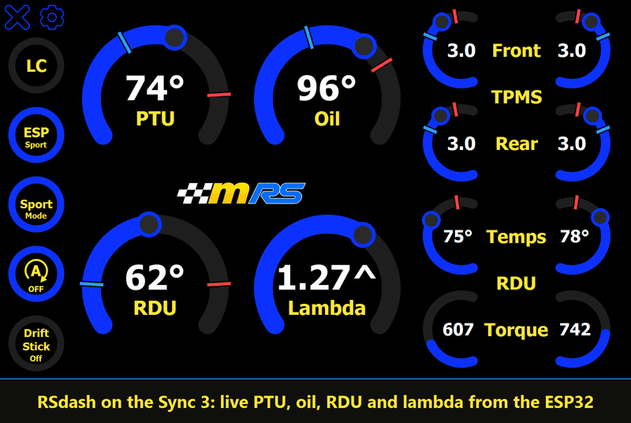
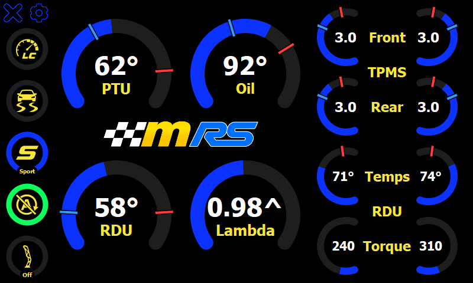
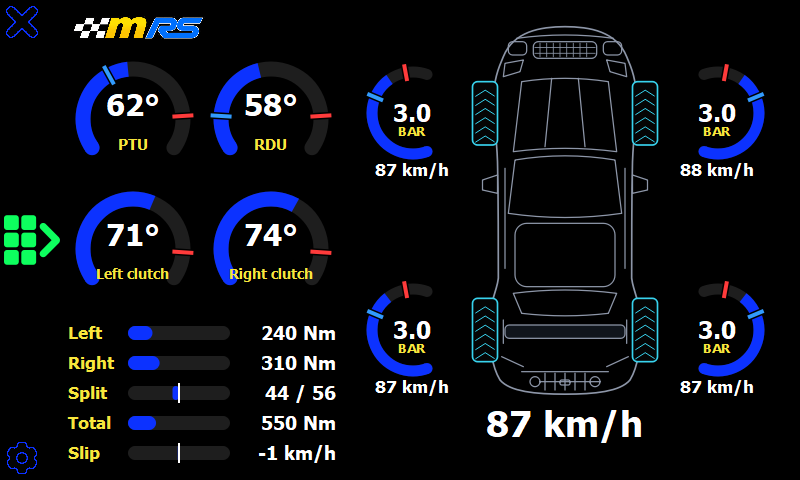
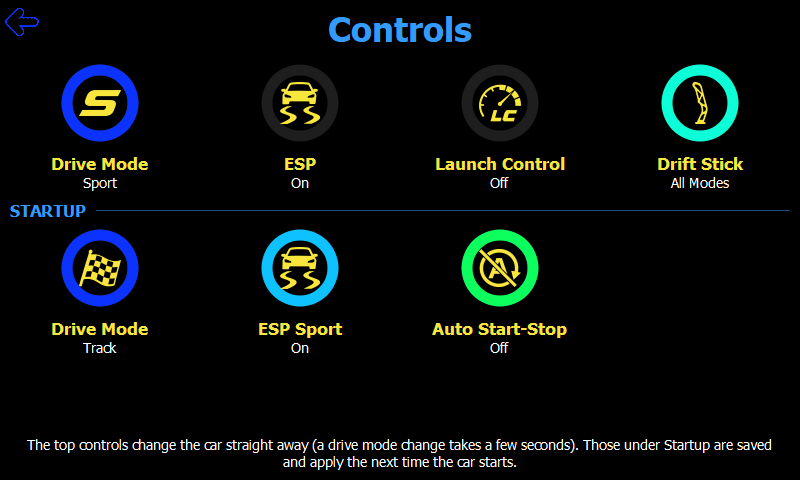
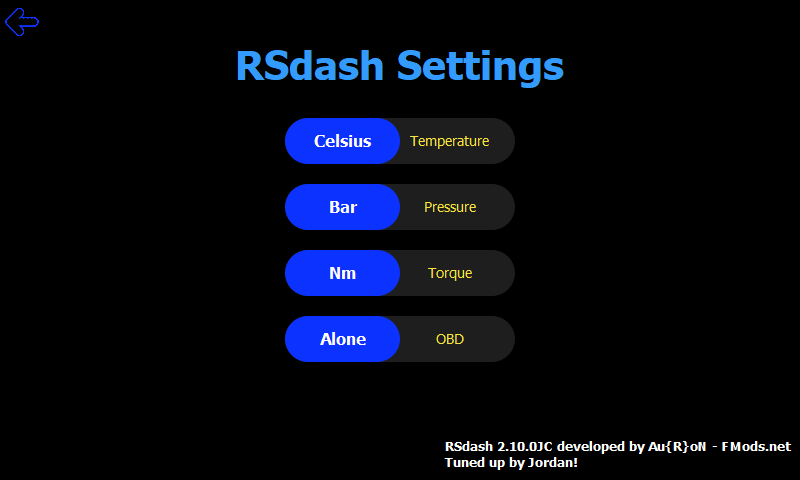

# RSdash Reloaded

A Ford Sync 3 dashboard app for the **Focus RS Mk3.5**: live gauges, an AWD page, and controls for drive mode and ESP, shown on the car's own screen.

It's a modified build of **RSdash**. The app reads its data from an ESP32 CAN bus module over Wi-Fi, so you need that module (see [Requirements](#requirements)).

A sharper version is in [docs/RSDashTour.mp4](docs/RSDashTour.mp4).

## Features

- **Engine page**: boost, gear, a G-force plot, coolant, oil, intake air, PTU and RDU temps, brake, steering and yaw bars, battery voltage, date and time.
- **AWD page** (tap the logo): PTU, RDU and clutch temps, clutch torque, torque split, slip, and a top-down car with each tire's pressure and wheel speed.
- **Controls page**: change the drive mode and ESP on the fly, and set Launch Control, Drift Stick, and the startup drive mode, ESP Sport and Auto Start-Stop.
- **Warnings**: each gauge turns red outside its limits. Tire pressure limits can be changed for other tires, such as drag radials.
- **Ready To Race**: a pop-up once the oil, PTU and RDU are warm.
- **Units**: Fahrenheit/Celsius, PSI/bar, mph/km/h and Lb-Ft/Nm. Imperial is the default.

| Engine page | AWD page |
|:---:|:---:|
|  |  |
| **Controls** | **Settings** |
|  |  |

The screenshots are rendered on a PC with the [dev harness](dev/README.md), so the fonts differ slightly from the Sync 3.

## Requirements

- A Ford Focus RS Mk3.5 with a Sync 3 and [FMods Tools](https://www.fmods.net) 2.8 or newer, plus the Custom Apps Loader.
- An ESP32 CAN bus module with the Nutron firmware, with the Sync 3 joined to its Wi-Fi hotspot.
- Newer ESP32 firmware than the bundled RSapp 2.8.1 for everything to work. With 2.8.1 the app still runs, but only shows the values that firmware sends, and the live drive mode and ESP controls say "Not available". The newer firmware isn't in this repo.

## Install

Copy the `SyncMyMod` folder to a USB stick and plug it into the Sync 3. The installer (`autoinstall.sh`) stops with a message if FMods Tools or the Custom Apps Loader is missing. An update resets your saved units and tire limits to the defaults.

## Documentation

The [wiki](https://github.com/Degrader/RSDash_Reloaded/wiki) has the details: the PID reference, CAN frames, DIDs, FORScan PIDs and more. The full list of changes is in the [changelog](CHANGELOG.md), and the bundled `RSdash2.3 Manual.pdf` covers the original RSdash 2.3 (the pages in this build are different).

## Development

`dev/` has a harness that runs the app on a PC against a fake ESP32, clicks through it, checks for QML errors and Sync 3 compatibility problems, and takes the screenshots. See [dev/README.md](dev/README.md).

## Credits

- **Au{R}oN - Fmods.net** ([www.fmods.net](https://www.fmods.net)): original RSdash app, its design and gauge layout.
- **Toki - Nutron Pro Moto** ([www.promoto.nutron.pl](https://www.promoto.nutron.pl)): the ESP32 CAN bus module and its firmware.

This fork keeps the original look and ESP32 endpoints, and adds the engine, AWD and Controls pages, a speed unit, and faster, lighter polling and redrawing. All credit for the original work goes to the authors above.
