# RSdash Reloaded

This is a modified build of **RSdash**, originally developed by **Au{R}oN - Fmods.net** ([www.fmods.net](https://www.fmods.net)), with ESP32 canbus firmware by **Toki - Nutron Pro Moto** ([www.promoto.nutron.pl](https://www.promoto.nutron.pl)).

RSdash is a free application specifically developed for the Ford Focus RS MK3.5. An ESP32 canbus microcontroller with the custom Nutron firmware is REQUIRED, and the Sync 3 has to be connected to its WiFi hotspot; see [Firmware and install](#firmware-and-install).

All credit for the original design, the gauge layout, and the ESP32 firmware goes to the original authors above. This fork keeps the original app's look and its ESP32 endpoints, and adds an engine page and an AWD page, a Controls page that changes the car's drive mode and ESP straight away, a speed unit, and work on how often the app talks to the ESP32 and redraws. Every change is in the [changelog](#changelog).

## Video tour

A sharper version is in [docs/RSDashTour.mp4](docs/RSDashTour.mp4). It's recorded on a PC by `dev/tour.py`, against the fake ESP32 with its values drifting. To re-record it after a UI change, run `python dev/tour.py`.

## Screenshots

### Gauge pages

| Engine page | AWD page (tap the logo) |
|:---:|:---:|
|  |  |
| **Engine page, past its limits** | **AWD page, past its limits** |
| 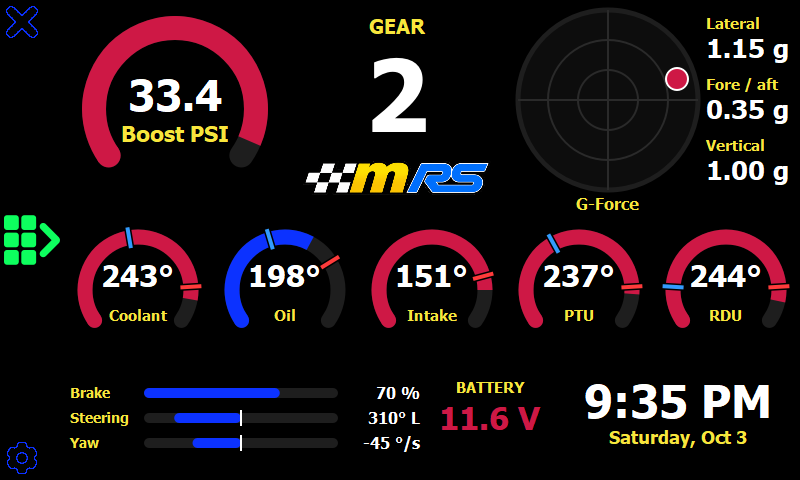 | 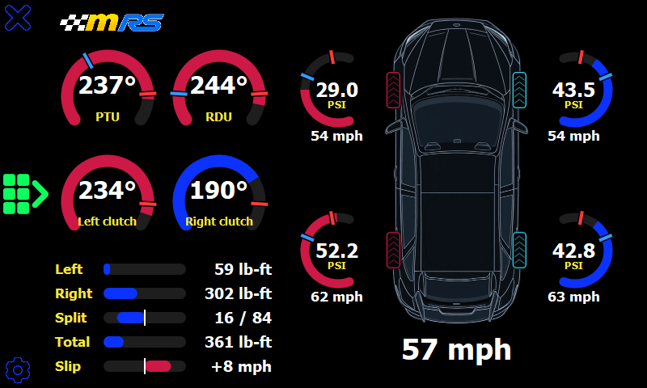 |
| **Metric units** (set on the settings page) | **Ready To Race** (PTU, RDU and oil all warm) |
| 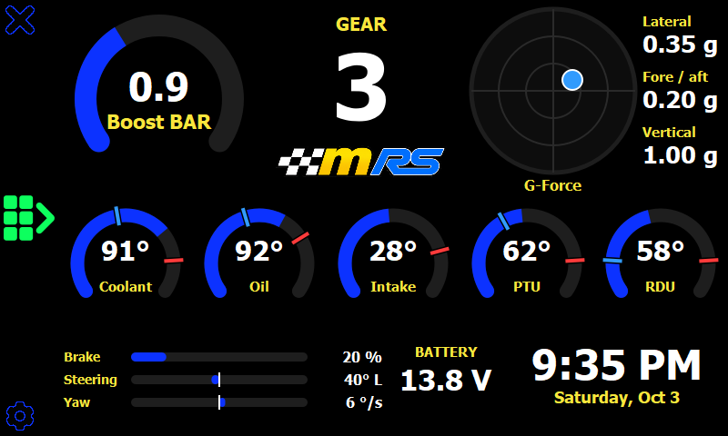 | 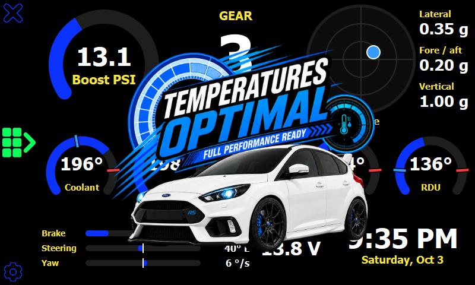 |

### Controls (button on the left edge)

| Controls | Changing the drive mode |
|:---:|:---:|
|  | 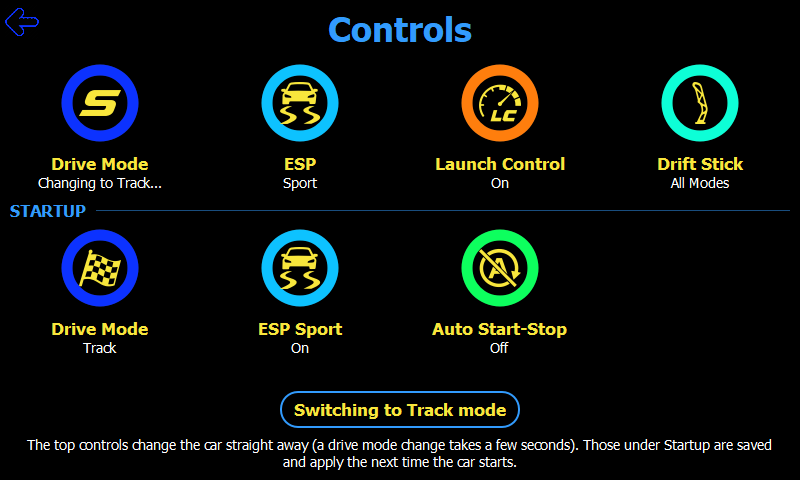 |
| **Drive Mode** (tap Drive Mode, top row) | **ESP** (tap ESP, top row) |
| 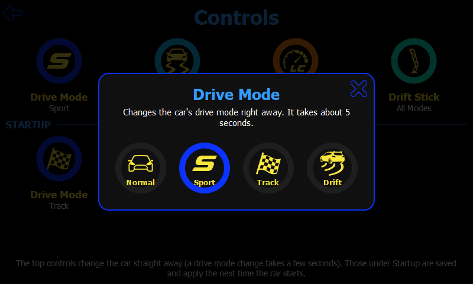 | 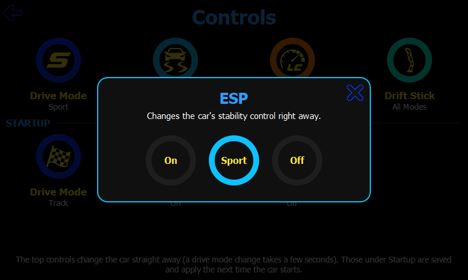 |
| **Startup drive mode** (tap Drive Mode under Startup) | **Drift Stick pop-up** (tap Drift Stick) |
| 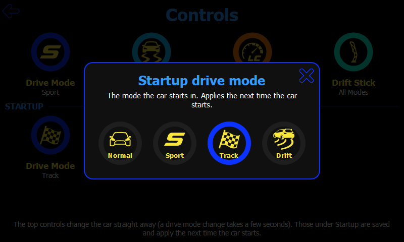 | 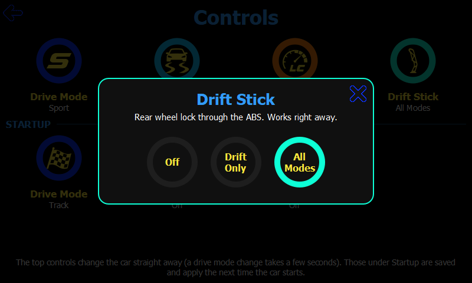 |

### Settings

| Settings | Controls help (settings, bottom left) |
|:---:|:---:|
|  | 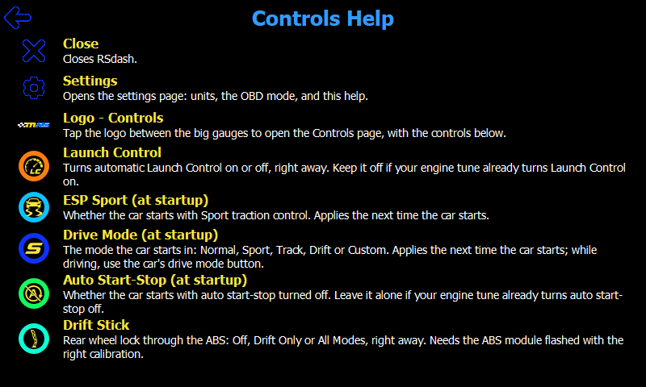 |
| **Tire pressure limits** (settings, on the right), set for drag radials | **AWD page** with those limits: the 12 psi rear tires are in range |
| 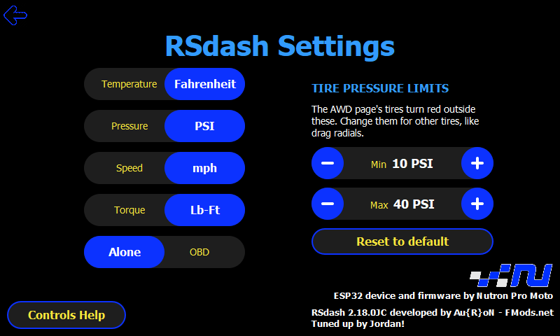 | 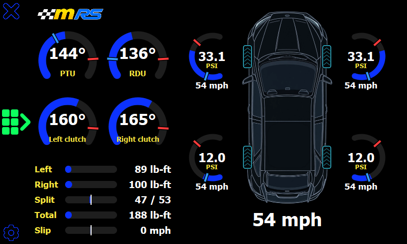 |

These are rendered on a PC by the [dev harness](dev/README.md), using a fake ESP32 and the default units (imperial, except the metric one), so the fonts differ slightly from the Sync 3. To update them after a UI change, run `python dev/harness.py --readme-shots`.

## What it does

RSdash is a few pages on the Sync 3 screen. They read live values from the ESP32 over its Wi-Fi (`http://192.168.80.1/`) and show them in the units chosen on the settings page. The ESP32 sends °C, bar, Nm and km/h; the app converts. The buttons down the left edge of the two gauge pages are close (top), Controls (the green grid, in the middle) and settings (bottom).

### Engine page

The page you land on. **Boost** is the big gauge on the left, with the **gear** (N, 1-6, R) and the pulsing logo in the middle, and a **G-force plot** (a dot on 0.5 g rings) with lateral, fore/aft and vertical G on the right. A row of five temp gauges follows: **coolant**, **oil**, **intake air**, **PTU** and **RDU**. **Brake**, **steering** and **yaw** are small bars along the bottom left; steering and yaw fill from the middle, so you can see which way. The **battery voltage** and the system **date and time**, in the Sync 3's own 12 or 24 hour format, are at the bottom right. Tap the logo for the AWD page.

The **Ready To Race** logo pulses once, the first time the oil is at 65 °C, the PTU at 50 °C and the RDU at 20 °C. It shows once until the app is restarted, on either gauge page.

### AWD page

On the left is the AWD system: **PTU**, **RDU** and **left and right clutch** temps, then bars for each clutch's **torque**, the **split** between them (left / right in %, filling from the middle towards the side carrying more; "- / -" under 10 Nm total), the **total** torque, and **slip**, how much faster the rear wheels turn than the front. On the right is the car from above, with a **tyre pressure** ring beside each tyre, opening towards it, the **wheel speed** under it, and the car's **speed** below. Tap the logo to go back to the engine page.

### When a reading goes red

Each gauge turns red outside its limits. Temp gauges and tyre rings also have a blue mark on the ring where "cold" ends and a red one where "hot" starts (not for a limit at the end of the scale). The limits are set in the units the ESP32 sends, apart from the tyres and boost, which are set in psi.

| Reading | Scale | Red when |
|---|---|---|
| Boost | 0-35 psi | over 2.2 bar (32 psi) |
| G-force dot | rings to 1.5 g | past 1 g |
| Coolant | 0-130 °C | under 60 or over 110 |
| Oil | 0-150 °C | under 65 or over 110 |
| Intake air | -20-80 °C | over 60 |
| PTU | 0-130 °C | under 50 or over 110 |
| RDU | 0-130 °C | under 20 or over 110 |
| Left and right clutch | 0-120 °C | over 105 |
| Tire pressure | 0-4 bar | under 35 psi or over 50 psi, or whatever limits are set on the settings page (the tire is drawn red too) |
| Slip | -20 to 20 km/h | over 8 km/h |
| Battery | | under 12 V or over 15 V |

Not checked on the car: which way `latG` and `longG` point. The G plot puts a positive lateral G to the right and a positive longitudinal G up; `flipLateral` and `flipLongitudinal` on `GForceGauge` swap them.

### Controls

The Controls page has the car's controls as tiles in two rows. The top row changes the car straight away:

- **Drive Mode** (Normal, Sport, Track, Drift) and **ESP** (On, Sport, Off) press the car's own buttons through the ESP32, and nothing is saved. The tiles show what the car is in now, read from `/pids` every second, and say "Changing to Sport..." until the car has made the change (a drive mode change takes about 5 s), or "Not available" while the car is asleep or the firmware doesn't report it.
- **Launch Control** (the car's automatic launch control) and **Drift Stick** (rear wheel lock through the ABS: Off, Drift Only or All Modes; needs a flashed ABS module) are ESP32 settings that work right away.

Under **Startup** are the preferences the ESP32 applies the next time the car starts: the **Drive Mode** it starts in, **ESP Sport** and **Auto Start-Stop**. Launch Control, ESP Sport and Auto Start-Stop switch with a tap; the other tiles open a pop-up. A note after each change says what it did, or why it couldn't: the car isn't ready (asleep, or no CAN), the firmware is too old, or the ESP32 couldn't be reached. The page re-reads the ESP32's settings every 5 s, so it catches up when something is changed from the RSapp phone app.

### Settings

A toggle for each unit: **Temperature** (Celsius, Fahrenheit), **Pressure** (Bar, PSI), **Speed** (km/h, mph) and **Torque** (Nm, Lb-Ft). They're saved in `NutronConfig.ini` on the Sync 3 and default to Fahrenheit, PSI, mph and Lb-Ft.

The **tire pressure limits**, **Min** and **Max**, are the pressures the AWD page's tire rings and tires go red outside of, 35 and 50 psi to start with. They're for other tires, like drag radials. A tap changes a limit by 1 psi (0.1 bar when the pressure unit is Bar) and holding a button keeps going; a limit stops a step short of the other. **Reset to default** puts both back. They're saved in `NutronConfig.ini` (`TirePressureMinPsi` and `TirePressureMaxPsi`), the rings' blue and red marks move with them, and the ring's scale widens if the maximum is high. One pair covers all four tires, so if the fronts and rears run very different pressures, it has to span both.

The **OBD** toggle (Alone, Not Alone) is for when a COBB Accessport, a scan tool or another OBD device is plugged in: Not Alone makes the ESP32 stop requesting lambda from the engine computer, so the other device can use it. It's stored on the ESP32 (as `cobbFriendly`), so it persists and stays in sync with the RSapp phone app.

**Controls Help** explains each button and tile. The page also credits Nutron and the app's authors.

### Talking to the ESP32

- `GET /pids` every 250 ms on the gauge pages, and every second on the Controls page. The engine page reads `boost` (bar), `gear` (0 neutral, 1-6, 7 reverse), `coolant`, `engine` (oil), `iat`, `ptu` and `rdu` (°C), `latG`, `longG` and `vertG` (g), `yaw` (°/s), `steering` (°, positive to the right), `brake` (%) and `battery` (V). The AWD page reads `ptu`, `rdu`, `engine`, the clutch temps `rdutl` and `rdutr`, the clutch torque `rdutql` and `rdutqr` (Nm), the tyre pressures `flw`, `frw`, `rlw` and `rrw` (bar), the wheel speeds `wheelFL`, `wheelFR`, `wheelRL` and `wheelRR` and the car's `speed` (km/h). Controls reads `mode` (0 Normal, 1 Sport, 2 Track, 3 Drift) and `esc` (0 On, 1 Sport, 2 Off).
- `GET` and `POST /settings` (JSON) for `enableLC`, `esp`, `disableStartStop`, `driveMode`, `enableDriftMode`, `driftInAllModes` and `cobbFriendly`.
- `POST /control` with `{"mode": 0-3}` or `{"esc": 0-2}` for the live Drive Mode and ESP. The app reads a 503 as the car not being ready and a 404 as a firmware that doesn't have it.
- A poll is skipped if the previous one for the same endpoint hasn't finished, so a slow reply can't pile requests up on the ESP32's single-threaded HTTP server, and a request still unanswered after 3 s is abandoned, so one that never gets a reply (the ESP32 rebooting mid-response) can't block polling for good.
- Responses are checked for a successful HTTP status and parsed inside a try/catch, so a dropped connection or a bad reply is logged and skipped. A value the firmware doesn't send is left alone.
- Gauges repaint only when their value changes, and not at all while they're hidden.

## Firmware and install

`ESP32 Firmware RSapp2.8.1.zip` has the original RSapp 2.8.1 firmware and its update manual, but this build needs a newer one. The 2.8.1 `/pids` sends only the tyre pressures, `ptu`, `rdu`, `engine`, the clutch temps and torque, and `lambda`, and it has no `/control`. With it, RSdash shows what it does send (the AWD page's temps, torque and tyre pressures, and the PTU, RDU and oil temps on the engine page); the other readings stay at zero, with the gear and the battery showing "-" and "--". The live Drive Mode and ESP tiles say "Not available", a change gets "This ESP32 firmware can't do that yet", and the rest of the Controls page works. The newer firmware, which sends everything listed above and takes `POST /control`, isn't in this repo.

To install, put the `SyncMyMod` folder on a USB stick and plug it into the Sync 3. The installer (`autoinstall.sh`) needs FMods Tools 2.8 or newer and the Custom Apps Loader, and stops with a message if either is missing. An update replaces the saved units with the defaults (`OVERWRITE_CONFIG` in `autoinstall.sh`). `RSdash2.3 Manual.pdf` is the manual for the original RSdash 2.3; the pages in this build are different.

## Testing on a PC

`dev/` has a harness that runs the app against a fake ESP32, clicks through it, checks for QML errors and Sync 3 compatibility problems, and takes screenshots. See [dev/README.md](dev/README.md).

## Changelog

All notable changes to this project will be documented in this file.

The format is based on [Keep a Changelog](https://keepachangelog.com/en/1.0.0/),
and this project adheres to [Semantic Versioning](https://semver.org/spec/v2.0.0.html).

From 2.7.0 on, versions are MAJOR.MINOR.PATCH, set in `SyncMyMod/app/version.txt` (the "JC" suffix marks this fork):

- **MAJOR** for big or incompatible changes, such as needing new ESP32 firmware
- **MINOR** for new features and changes that stay compatible
- **PATCH** for bug fixes only

### [0.1] - 2024-04-25
- Initial Private Release

### [0.4] - 2024-04-26
- Added ESP and Drift Mode Controller
- Improved POST execution time
- Added PSI / BAR and C / F selector

### [1.0] - 2024-08-25
- First Public Release
- Refresh timer set to 1000
- Settings json has been set to be read only at startup(from now on you cannot see SDM changes if they requested through the car IPC)
- Fixed a Syncronization issue between values and GUI

### [2.0] - 2025-03-09
- Heavy code refactory
- Added ECU + / - to select pcm tune (latest ESP32 firmware required)
- Added Left and Right RDU Temp and Torque
- Added the ability to suppress canbus diagnostic in case of multiple obd devices plugged in (latest ESP32 firmware required)
- Added settings page to select default extra view and unit measures

### [2.3] - 2025-10-03
- Temporary removed ECU + / - UI
- Changed the way to switch between TPMS and RDU Views
- Minor UI Adjustments
- Added Ready To Race Popup (it appear when RDU, PTU and OIL (Engine) temps reach the treshold value
- Removed settings button from main page
- Removed close button from secondary page

### [2.3JC] - Reloaded fork
- Decoupled COBB presence polling from the 250ms live-data timer onto its own 5s timer
- Added in-flight request guards to prevent overlapping polls to the ESP32
- Added HTTP status checks and safe JSON parsing around all ESP32 requests
- Switched all gauge Canvas repaints from a fixed 100ms timer to repaint-on-change, skipping hidden gauges
- Fixed the Ready-to-Race popup's missing `res/rtr2.png` reference

### [2.4JC] - 2026-09-26
- Added a 3s timeout to the in-flight request guards so a request that never completes can't stop polling
- Tapping the lambda gauge to enable COBB now shows an orange "COBB APv3 / CONNECTING" state until the ESP32 confirms it; taps are ignored while connecting, and a COBB check runs as soon as the change is accepted instead of waiting for the 5s timer
- Fixed torque gauges drawing the indicator dot
- Installer now keeps the user's existing `NutronConfig.ini` on update (set `OVERWRITE_CONFIG="true"` in `autoinstall.sh` to force a replace)

### [2.5JC] - 2026-09-26
- Moved NOT ALONE from the lambda gauge tap to a new "OBD" setting (Alone / Not Alone) on the settings page, stored on the ESP32 and synced with the RSapp phone app
- In Not Alone mode the lambda slot now shows both RDU clutch temps in a new split gauge, replacing the "COBB APv3" connecting/connected label
- Swapped the Oil and lambda gauges: Oil is now top-center, lambda / RDU clutch temps bottom-center
- Installer replaces `NutronConfig.ini` for this release (`OVERWRITE_CONFIG="true"`), resetting saved units and the extra view to their defaults

### [2.6JC] - 2026-09-26
- Fixed the settings page not re-reading the OBD mode when opened (an error on the line before it stopped it running)
- Fixed a binding loop warning in the Ready To Race popup trigger (no change in behavior)
- Added the `dev/` test harness (PC only, not installed)
- Installer still replaces `NutronConfig.ini` (`OVERWRITE_CONFIG="true"`), resetting saved units and the extra view to their defaults

### [2.7.0JC] - 2026-09-26
- Switched to MAJOR.MINOR.PATCH version numbers
- Drive mode page: the left group is now DRIFT STICK, with Drift Fury renamed to Drift Stick Enabled and moved to the far left, and the two DRIFT IN buttons replaced by one All Modes / Drift Mode Only toggle that's locked while Drift Stick is disabled
- Drive mode page: added the ESP Sport button under OTHERS, where Drift Stick was (moved from the main view)
- Drive mode page: the ASS button shows the auto start/stop symbol instead of text, drawn in QML so it scales and matches the button colours
- Main view: removed the ESP button (now on the drive mode page); LC moved between the four big gauges and the logo to the top of the right column
- Main view: the split gauge's caption is now "OBD" above "NOT ALONE"
- Main view: tire pressures and RDU torque are shown together, replacing the TPMS / RDU extra view; removed the Extra View setting
- Main view: tapping the RDU Torque row switches it to the RDU clutch temps and back
- Temperature gauges show a blue mark where "cold" ends and a red mark where "hot" starts (their low and high thresholds)
- RDU clutch temps now turn red above 105 °C (was 120 °C, the top of the scale), with a red mark at 105
- Tire pressures now turn red below 35 psi and above 50 psi (was 1.9 / 3.0 bar, about 27.6 / 43.5 psi), with blue and red marks at those limits
- Harness: added drive mode page, RDU row toggle and tire pressure scenarios, and checks for the new main view layout
- Installer still replaces `NutronConfig.ini` (`OVERWRITE_CONFIG="true"`), resetting saved units to their defaults

### [2.8.0JC] - 2026-09-27
- Main view: added a column of buttons down the left edge for LC, ESP Sport, drive mode, auto start/stop and Drift Stick, in that order; LC moved there from between the big gauges, and the big gauges are 210 px (was 220 px)
- Main view: the drive mode button shows the current mode and fans the five modes out in an arc to its right; tapping it again, tapping outside, or 8 seconds without a pick closes the fan without a change
- Main view: added the settings button (top left, beside the close button)
- Main view: removed the logo; the right column now shows the RDU clutch temps above the RDU torque, so all four RDU values are always visible, replacing the tap-to-switch RDU row; labelled like the TPMS rows (Temps, RDU, Torque), with the RDU values slightly smaller so four-digit torque clears the label
- Buttons and drive modes are lit in the gauges' blue (was green)
- Removed the drive mode page; its All Modes / Drift Only toggle is now on the settings page as "Drift Stick", locked while Drift Stick is disabled
- Settings page: the back button returns to the main view
- Removed the `checkDummyGauges()` helper and the flag that triggered it from `fetchData()` / `sendData()` (the drive mode button reads the mode directly)
- Harness: added main view button, drive mode fan, RDU rows and Drift Stick setting scenarios, and layout checks for the button column and the four right-hand rows; removed the drive mode page and RDU row toggle scenarios
- Installer still replaces `NutronConfig.ini` (`OVERWRITE_CONFIG="true"`), resetting saved units to their defaults

### [2.9.0JC] - 2026-09-27
- OBD Not Alone: the gauge in lambda's place shows the RDU torque split (each rear clutch's share of the total, in %) instead of the RDU clutch temps, which are now always in the right column
- Torque split reads 0 / 0 below 10 Nm total rear torque, and never turns red
- Main view: the logo is back, centred between the four big gauges, pulsing as before (50 px tall, as it was at the top of the right column)
- `SplitPlasmaGauge` has a `valueSpread` setting for how far apart its two values sit
- Main view: tapping Drift Stick fans out All Modes / Drift Only / Off, replacing the on/off tap and the settings page's Drift Stick toggle; the button's status shows the current choice
- `DriveModeFan` is now `RadialFan`, a general fan with its options and direction set by the page
- Added a video tour (`docs/tour.gif`, `docs/RSDashTour.mp4`), recorded by `dev/tour.py`
- Harness: Not Alone checks cover the torque split; added scenarios for all torque on one side and low torque, and for the Drift Stick fan (including a rejected change); shared fan layout checks; removed the settings page Drift Stick scenario
- Installer still replaces `NutronConfig.ini` (`OVERWRITE_CONFIG="true"`), resetting saved units to their defaults

### [2.10.0JC] - 2026-09-27
- Gauges: removed the round indicator circle; the coloured bar ends in a flat cut straight across the ring, exactly at the value (the start stays rounded, and no bar is drawn at the bottom of the scale)
- The value bar on all three gauge types is drawn by one shared `drawValueArc()` in `Controller.js`
- Main view: the logo is 80 px tall (was 50), centred in the free space between the big gauges' rings, which is 17 px higher than before
- Main view: the drive mode button reads Drive / <mode> / Mode, with the mode larger (new `topText` line on `ButtonGauge`)
- Fans: the stand-in for the button while a fan is open has a solid centre, so the button's own text no longer shows through behind "Close"
- Harness: added a pixel check that the bar is cut flat across the ring at the value, keeps its rounded start, and draws nothing at the bottom of the scale; the logo checks now measure against each ring as drawn (its arc, thickness and marks) and require 8 px of room at full pulse; video tour and screenshots re-rendered
- Installer still replaces `NutronConfig.ini` (`OVERWRITE_CONFIG="true"`), resetting saved units to their defaults

### [2.11.0JC] - 2026-09-27
- Settings page: added a Controls Help button (bottom left) that opens a page explaining what each main view control does
- Harness: added a controls help scenario and README screenshot; the video tour visits the help page
- Installer still replaces `NutronConfig.ini` (`OVERWRITE_CONFIG="true"`), resetting saved units to their defaults

### [2.12.0JC] - 2026-09-28
- Main view: each left-column button lights its ring in its own colour: LC orange, ESP cyan, Drive Mode blue, Auto Start-Stop green, Drift Stick aqua (off stays grey)
- The fans light the current choice in their button's colour, and the controls help page matches
- `ButtonGauge` repaints when its colour changes
- Main view: every left-column button is an icon filling its centre; only Drive Mode (mode name) and Drift Stick (current choice) have text, on a black tab over the bottom of the ring. The drive mode fan shows each mode's icon, and the controls help page uses the same icons
- Icons are traced SVGs in `docs/icons/`, converted by `dev/make_icons.py` (straight-line paths: M/L/H/V/Z, one or more per icon) into `Components/Icons.js` and drawn by `Components/SvgIcon.qml` on the QtQuick canvas; `ButtonGauge` has new `icon`, `iconSize`, `iconOffset`, `badgeText`, `badgeSize`, `badgeOffset` and `statusSize` settings
- Removed `StartStopIcon.qml` (replaced by the auto start-stop icon)
- Harness: added a pixel check of each button's ring colour, lit and off, and of the Drift Stick fan's lit choice; checks each button's icon and label, that each icon fits inside its ring and is actually drawn, and each drive mode's icon in the fan
- Installer still replaces `NutronConfig.ini` (`OVERWRITE_CONFIG="true"`), resetting saved units to their defaults

### [2.13.0JC] - 2026-09-28
- Drive mode fan: headed "Startup drive mode", saying it applies the next time the car starts (the ESP32's drive mode, ESP Sport and auto start-stop settings are startup preferences, not live controls)
- Changing drive mode, ESP Sport or auto start-stop shows a short note that it applies from the next start, or that the ESP32 couldn't be reached
- The app re-reads the ESP32's settings every 5 seconds instead of only when it opens, so it shows the right settings even if it opened before the Sync 3 joined the ESP32's Wi-Fi
- Controls help: descriptions follow the RSdash manual (automatic Launch Control, startup settings, Drift Stick as ABS rear wheel lock)
- Harness: startup settings scenario (notes, fan heading, failed change, catching up with the ESP32)
- Installer still replaces `NutronConfig.ini` (`OVERWRITE_CONFIG="true"`), resetting saved units to their defaults

### [2.14.0JC] - 2026-09-28
- Settings page: Nutron's logo and an "ESP32 device and firmware by Nutron Pro Moto" credit above the author credit
- The main view's logo image is renamed `res/mountuners.png`; `res/nutron.png` is now Nutron's logo
- Harness: checks the Nutron logo loads and sits clear of the settings
- Installer still replaces `NutronConfig.ini` (`OVERWRITE_CONFIG="true"`), resetting saved units to their defaults

### [2.15.0JC] - 2026-09-28
- New Controls page, opened by tapping the logo on the main view: Launch Control, ESP Sport, Drive Mode, Auto Start-Stop and Drift Stick as tiles in a three-column grid, with room for more
- Drive Mode and Drift Stick open a pop-up of their options instead of fanning out; Launch Control, ESP Sport and Auto Start-Stop switch with a tap, each with a short note saying what it did
- Main view: the button column and fans are gone and the gauges are centred; the settings button moved to the bottom left corner; removed `RadialFan.qml`
- Controls help: explains the logo and each control on the Controls page
- Harness: Controls page, drive mode pop-up, Drift Stick pop-up and settings sync scenarios replace the main view button and fan scenarios; README screenshots of the Controls page and its pop-ups
- Installer still replaces `NutronConfig.ini` (`OVERWRITE_CONFIG="true"`), resetting saved units to their defaults

### [2.16.0JC] - 2026-09-30
- Controls page: split into an untitled top row that changes the car now (Drive Mode, ESP, Launch Control, Drift Stick) and Startup (Drive Mode, ESP Sport, Auto Start-Stop)
- New live Drive Mode and ESP tiles: they show the car's current mode (from `/pids`) and change it now with `POST /control`; they say "Changing to ..." until the car has made the change, and why a change failed. Needs the rebuilt ESP32 firmware
- Tiles are smaller to fit two rows; the startup tiles no longer say "at startup"
- `fetchData` skips values missing from the response; `sendData` passes the HTTP status to its callback
- Controls help: the startup Drive Mode and ESP Sport mention the live tiles
- The startup Drive Mode pop-up no longer offers Custom; a Custom already saved on the ESP32 still shows on the tile
- Harness: the mock ESP32 reports `mode`/`esc` and takes `POST /control`; Controls scenarios cover both groups and the new live controls (changing, failing, not available); screenshots and tour updated
- Installer still replaces `NutronConfig.ini` (`OVERWRITE_CONFIG="true"`), resetting saved units to their defaults

### [2.17.0JC] - 2026-10-01
- The main view is now two pages. The engine page has boost, gear, a G-force plot, coolant, oil, intake, PTU and RDU temps, small brake, steering and yaw bars, and the date and time; the logo opens a new AWD page with the PTU, RDU and clutch temps, each clutch's torque, the torque split, total torque and front/rear slip on the left, and a top-down Focus RS with each tyre's pressure and wheel speed, and the car's speed, on the right
- A Controls button on the far left of both pages (the green `controls_grid_right` icon) opens Controls; the logo switches pages instead. Controls and settings go back to the page you left
- Removed the lambda gauge and the Not Alone torque split gauge (the new firmware always reports lambda as 0); the OBD toggle stays on the settings page but no longer affects the gauge pages
- New Speed unit toggle (km/h, mph) on the settings page; `SpeedUnit` in `NutronConfig.ini`
- New `PageChrome`, `ReadyToRace`, `GForceGauge`, `BarGauge` and `CarTopView` components; `Controller.formatValue()` and `unitLabel()`
- Controls help: new Controls button row, and the logo row is now "Logo - Second page"
- Harness: engine page, gear, speed units, AWD page, tyre limits, hot PTU/RDU, clutch torque lines and page navigation scenarios replace the old main view ones; the mock ESP32 sends all the new values; screenshots and tour updated
- Installer still replaces `NutronConfig.ini` (`OVERWRITE_CONFIG="true"`), resetting saved units to their defaults

### [2.17.1JC] - 2026-10-01
- Engine page: the battery voltage at the OBD port, between the brake, steering and yaw bars and the clock; "--" until the ESP32 has a reading, red under 12 V or over 15 V. The bars are narrower to make room
- Harness: battery checks, and the mock ESP32 sends `battery`; engine page screenshot updated
- `version.txt` still said 2.17.0 when this went out; 2.18.0 corrects it
- Installer still replaces `NutronConfig.ini` (`OVERWRITE_CONFIG="true"`), resetting saved units to their defaults

### [2.18.0JC] - 2026-10-03
- Units now default to imperial: Fahrenheit, PSI, Lb-Ft and mph (it was Celsius, bar, Nm and km/h). They're set in `NutronConfig.ini` and built into the app, so a missing or unreadable ini no longer leaves the temperature, pressure and torque units blank. The settings page still switches each one
- Removed code nothing used: `AlternativeButtonGauge`, `ECUGauge` and `SplitPlasmaGauge`, `Controller.getValueREADABLE()`, the `ignoreUnit` and `valueOffset` settings, and `ButtonGauge`'s status, top text and badge options
- `PlasmaGauge` now draws every ring gauge (`SemiCircularGauge` is gone), with the usual colours, angles and size as defaults, and has `outOfRange`. New `TempGauge` and `TyreGauge` hold the settings the temperature and tyre rings share, which takes about 250 lines out of the two gauge pages
- `CustomToggle` handles its own tap and emits `toggled(value)`, so the settings page's unit toggles are four lines each; the ini is saved from the app's unit settings
- `Controller.PSI_PER_BAR` and `psiToBar()` replace `14.5038` written out in five places, and the unit conversion table is built once
- Fixed a small negative reading showing as "-0" (the AWD page's Slip read "-0 mph" at rest)
- AWD page: the car is now a picture of the Focus RS from above (`res/car_top.png`, made from `docs/car/focus_rs_top.webp` by `dev/make_car.py`, which fills a gap in the picture's roof and takes out its own tyres), in place of a line drawing. The four tyres are still drawn on top, in the picture's style, so each turns red with its pressure. The car is 180 px wide (was 200), about the same height
- Settings: new tire pressure limits, Min and Max, for other tires like drag radials. The AWD page's tire rings, their blue and red marks and the tires on the car go red outside them (35 and 50 psi unless changed). Each tap is 1 psi, or 0.1 bar when the units are bar, and holding repeats; Reset to default puts them back. Saved in `NutronConfig.ini` as `TirePressureMinPsi` and `TirePressureMaxPsi`, and a pair that makes no sense is ignored. The units are now on the left of the page and the limits on the right; new `LimitStepper` component
- The dev harness's `--interactive` window starts in the app's default units (it was metric, from the scenarios' pinning)
- Controls: the top row's pop-ups are headed "Drive Mode" and "ESP" (they said "Drive mode now" and "ESP now")
- Fixed stale comments (the Controls page opens from the left-edge button; the OBD toggle no longer changes the gauge pages)
- README: the running "What's changed in this fork" section is now "What it does", describing the app as it is, with the red limits and what it reads from the ESP32; new "Firmware and install" section, which says what the bundled RSapp 2.8.1 firmware can't feed
- Harness: scenarios still start in the ESP32's own units (`start_app(units="shipped")` uses the app's), new `default_units` and `tire_limits_setting` scenarios, a check for "-0"; the screenshots and the video tour are rendered in the default units
- New screenshots: the engine and AWD pages past their limits, the engine page in metric, Ready To Race, the live drive mode and ESP pop-ups, the Controls page while a drive mode change is under way, and the tire pressure limits with the AWD page they set up
- Installer still replaces `NutronConfig.ini` (`OVERWRITE_CONFIG="true"`), resetting saved units and tire pressure limits to their defaults, which are now imperial
