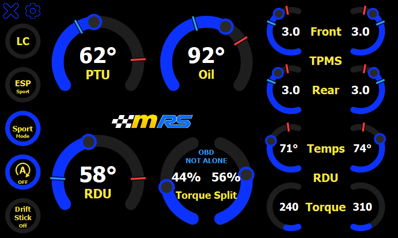
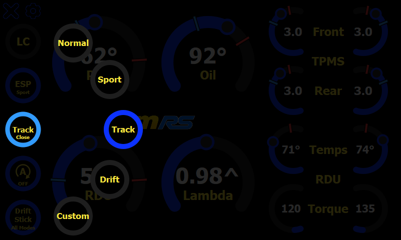
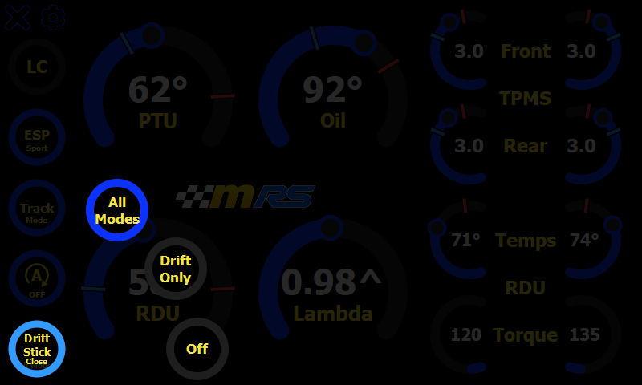

# RSdash Reloaded

This is a modified build of **RSdash**, originally developed by **Au{R}oN - Fmods.net** ([www.fmods.net](https://www.fmods.net)), with ESP32 canbus firmware by **Toki - Nutron Pro Moto** ([www.promoto.nutron.pl](https://www.promoto.nutron.pl)).

RSdash is a free application specifically developed for the Ford Focus RS MK3.5. To use the app "as is," an ESP32 canbus microcontroller with the custom Nutron firmware is REQUIRED — get the firmware and installation guide from the `ESP32 Firmware` folder. Sync 3 has to be connected to the CANbus ESP32 microcontroller's WiFi hotspot.

All credit for the original design, the gauge layout, and the ESP32 firmware goes to the original authors above. This fork keeps their app intact and focuses on tightening up performance on the Sync 3 head unit, plus a few layout and settings changes.

## Video tour

A sharper version is in [docs/tour.mp4](docs/tour.mp4). It's recorded on a PC by `dev/tour.py`, against the fake ESP32 with its values drifting. To re-record it after a UI change, run `python dev/tour.py`.

## Screenshots

| Main view | Main view, OBD Not Alone |
|:---:|:---:|
|  |  |
| **Drive mode fan** (tap the mode button) | **Drift Stick fan** (tap Drift Stick) |
|  |  |
| **Settings** | |
|  | |

These are rendered on a PC by the [dev harness](dev/README.md), using a fake ESP32 and the default units, so the fonts differ slightly from the Sync 3. To update them after a UI change, run `python dev/harness.py --readme-shots`.

## What's changed in this fork

Starting from v2.3, this build makes the app talk to the ESP32 less often and redraw the gauges only when something actually changes, instead of on fixed timers regardless of activity:

- **Network polling** (`SyncMyMod/app/PrimaryView.qml`, `SyncMyMod/app/Components/Controller.js`)
  - The OBD Alone / Not Alone check (originally the COBB presence check) no longer rides along on the 250ms live-data poll. It now runs on its own 5-second timer, roughly halving the request rate to the ESP32.
  - Both the live-data fetch and the OBD mode check now skip firing a new request if the previous one for that endpoint hasn't finished yet, so a slow response can't cause requests to pile up on the ESP32's single-threaded HTTP server. A request that hasn't finished after 3 seconds is abandoned, so one that never gets a reply (e.g. the ESP32 rebooting mid-response) can't block polling for good.
  - Responses are now checked for a successful HTTP status and safely parsed (try/catch around `JSON.parse`), so a dropped connection or bad reply is logged and skipped instead of throwing inside the poll timer.

- **Gauge rendering** (all `Components/*Gauge.qml` files)
  - Every gauge previously repainted its Canvas on a free-running 100ms timer regardless of whether its value had changed. Gauges now repaint only when their value actually changes.
  - A gauge that's currently hidden (e.g. the TPMS vs. RDU extra-info area, or the invisible "dummy" gauges used to drive drive-mode state) no longer does any redraw work while hidden, and repaints once immediately when it becomes visible again.

- **Assets**
  - Fixed the Ready-to-Race popup referencing a missing `res/rtr2.png`; it now points at the `res/rtr.png` file that's actually shipped.

Starting from v2.5, the NOT ALONE function has moved to the settings page and the main view layout has changed:

- **OBD setting** (`SyncMyMod/app/SettingsView.qml`, `SyncMyMod/app/Nutron.qml`)
  - The original app's NOT ALONE function, for when a COBB Accessport, scan tool or other OBD device is plugged in, is now an **OBD** toggle on the settings page, with the states **Alone** and **Not Alone**. It is no longer toggled by tapping the lambda gauge.
  - The setting is stored on the ESP32 (as `cobbFriendly`), not in `NutronConfig.ini`, so it persists across restarts and stays in sync with the RSapp phone app. The toggle dims while the change is sent and only flips once the ESP32 accepts it.

- **Main view** (`SyncMyMod/app/PrimaryView.qml`, `SyncMyMod/app/Components/SplitPlasmaGauge.qml`)
  - Oil temp is now top-center; lambda is bottom-center.
  - In Not Alone mode the ESP32 stops requesting lambda, the only value it asks the engine computer (PCM) for, so the lambda slot shows both RDU clutch temps side by side in a new split gauge instead. These come from the AWD module and keep updating.

Starting from v2.7.0, the main view and the drive mode page have been rearranged:

- **Main view** (`SyncMyMod/app/PrimaryView.qml`, `SyncMyMod/app/SettingsView.qml`)
  - The ESP button has moved to the drive mode page. LC now sits in the gap between the four big gauges, and the logo (still the way to the drive mode page) heads the right column.
  - Tire pressures and RDU torque are always shown together, evenly spaced under the logo, so the Extra View setting (TPMS / RDU) is gone. Tap the RDU Torque row to switch it to the RDU clutch temps and back. The choice holds while the app is running, and it resets to torque on restart. In OBD Not Alone mode the clutch temps are also in the split gauge, which is now captioned "OBD / NOT ALONE".
  - Temperature gauges have a blue mark on the ring where "cold" ends and a red mark where "hot" starts, so you can see how close a reading is to turning red. The marks come from each gauge's `lowTreshold` / `highTreshold`, and are drawn by `drawThresholdMarks()` in `Controller.js`.
  - RDU clutch temps (the bottom row and the Not Alone split gauge) turn red above 105 °C, the red line for each clutch, and show a red mark there. They have no cold threshold, so there's no blue mark.
  - Tire pressures turn red below 35 psi (low) and above 50 psi (high); 41-46 psi is normal. The tire gauges also show the marks: blue at 35 psi, red at 50 psi. The ESP32 sends bar, so the limits are written in psi and converted (`35 / 14.5038`).

- **Drive mode page** (`SyncMyMod/app/SecondaryView.qml`, `SyncMyMod/app/Components/StartStopIcon.qml`)
  - The left group is now **DRIFT STICK**. The **Drift Stick Enabled** button (formerly Drift Fury) is on the far left. Next to it, the two DRIFT IN buttons are replaced by a single toggle between **All Modes** and **Drift Mode Only**, which is dimmed and can't be changed while Drift Stick is disabled.
  - OTHERS now has an ESP Sport button (the same setting as the main page's ESP button) and the auto start/stop button, which shows the standard auto start/stop symbol (an "A" in a circular arrow) instead of "ASS".

Starting from v2.8.0, everything is on one page:

- **Main view** (`SyncMyMod/app/PrimaryView.qml`, `SyncMyMod/app/Components/DriveModeFan.qml`)
  - A column of buttons runs down the left edge, top to bottom: LC, ESP Sport, drive mode, auto start/stop and Drift Stick. Each ring is lit in the gauges' blue while its setting is on. The gauges are slightly smaller (210 px) to make room.
  - The drive mode button shows the current mode. Tapping it dims the page and fans all five modes out in an arc to its right, the current one lit. It sits in the middle of the column so the fan has the full screen height. Picking a mode sends it to the ESP32 and closes the fan. Tapping the drive mode button again, anywhere else, or waiting 8 seconds closes it without a change.
  - The right column runs the full height with four rows: front and rear tire pressures, then the RDU clutch temps above the RDU torque, so all four RDU values are always shown. They're labelled like the tire pressures: Temps and Torque on their rows, with RDU centred between them. Tapping the RDU row no longer switches between them. The logo is gone to make room.
  - The settings button is at the top left, beside the close button.

- **Drive mode page removed** (`SyncMyMod/app/SecondaryView.qml`)
  - Its buttons are on the main view now. The All Modes / Drift Only choice for Drift Stick is a toggle on the settings page (`SyncMyMod/app/SettingsView.qml`), still dimmed and locked while Drift Stick is disabled. The settings page's back button returns to the main view.

Starting from v2.9.0, OBD Not Alone mode shows the RDU torque split, and Drift Stick has its own fan:

- **Main view** (`SyncMyMod/app/PrimaryView.qml`, `SyncMyMod/app/Components/SplitPlasmaGauge.qml`)
  - With the RDU clutch temps always in the right column, the gauge that replaces lambda in Not Alone mode now shows how the rear torque is split between the left and right clutches: each half is that clutch's share of the total, in %. It's worked out from the RDU torque values, which keep updating in Not Alone mode, so it needs no firmware change.
  - Below 10 Nm total (cruising or parked) there's no real split, so both halves read 0 instead of jumping around. A share never turns the gauge red.
  - The logo is back, centred between the four big gauges and pulsing.

- **Drift Stick fan** (`SyncMyMod/app/PrimaryView.qml`, `SyncMyMod/app/Components/RadialFan.qml`)
  - Tapping Drift Stick fans out three choices up and to the right: **All Modes**, **Drift Only** and **Off**, with the current one lit. The button is lit while Drift Stick is on, and its status line shows the current choice.
  - Each pick sends only what changes. Turning it on sends `enableDriftMode` first, and the All Modes / Drift Only choice (`driftInAllModes`) only once the ESP32 accepts, the same order the old buttons used. The settings page toggle is gone.
  - The drive mode fan is now the general `RadialFan` component, used by both buttons.

## Testing on a PC

`dev/` has a harness that runs the app against a fake ESP32, clicks through it, checks for QML errors and Sync 3 compatibility problems, and takes screenshots. See [dev/README.md](dev/README.md).

## Changelog

All notable changes to this project will be documented in this file.

The format is based on [Keep a Changelog](https://keepachangelog.com/en/1.0.0/),
and this project adheres to [Semantic Versioning](https://semver.org/spec/v2.0.0.html).

From 2.7.0 on, versions are MAJOR.MINOR.PATCH, set in `SyncMyMod/app/version.txt` (the "JC" suffix marks this fork):

- **MAJOR** for big or incompatible changes, such as needing new ESP32 firmware
- **MINOR** for new features and changes that stay compatible
- **PATCH** for bug fixes only

### [0.1] - 2024-04-25
- Initial Private Release

### [0.4] - 2024-04-26
- Added ESP and Drift Mode Controller
- Improved POST execution time
- Added PSI / BAR and C / F selector

### [1.0] - 2024-08-25
- First Public Release
- Refresh timer set to 1000
- Settings json has been set to be read only at startup(from now on you cannot see SDM changes if they requested through the car IPC)
- Fixed a Syncronization issue between values and GUI

### [2.0] - 2025-03-09
- Heavy code refactory
- Added ECU + / - to select pcm tune (latest ESP32 firmware required)
- Added Left and Right RDU Temp and Torque
- Added the ability to suppress canbus diagnostic in case of multiple obd devices plugged in (latest ESP32 firmware required)
- Added settings page to select default extra view and unit measures

### [2.3] - 2025-10-03
- Temporary removed ECU + / - UI
- Changed the way to switch between TPMS and RDU Views
- Minor UI Adjustments
- Added Ready To Race Popup (it appear when RDU, PTU and OIL (Engine) temps reach the treshold value
- Removed settings button from main page
- Removed close button from secondary page

### [2.3JC] - Reloaded fork
- Decoupled COBB presence polling from the 250ms live-data timer onto its own 5s timer
- Added in-flight request guards to prevent overlapping polls to the ESP32
- Added HTTP status checks and safe JSON parsing around all ESP32 requests
- Switched all gauge Canvas repaints from a fixed 100ms timer to repaint-on-change, skipping hidden gauges
- Fixed the Ready-to-Race popup's missing `res/rtr2.png` reference

### [2.4JC] - 2026-09-26
- Added a 3s timeout to the in-flight request guards so a request that never completes can't stop polling
- Tapping the lambda gauge to enable COBB now shows an orange "COBB APv3 / CONNECTING" state until the ESP32 confirms it; taps are ignored while connecting, and a COBB check runs as soon as the change is accepted instead of waiting for the 5s timer
- Fixed torque gauges drawing the indicator dot
- Installer now keeps the user's existing `NutronConfig.ini` on update (set `OVERWRITE_CONFIG="true"` in `autoinstall.sh` to force a replace)

### [2.5JC] - 2026-09-26
- Moved NOT ALONE from the lambda gauge tap to a new "OBD" setting (Alone / Not Alone) on the settings page, stored on the ESP32 and synced with the RSapp phone app
- In Not Alone mode the lambda slot now shows both RDU clutch temps in a new split gauge, replacing the "COBB APv3" connecting/connected label
- Swapped the Oil and lambda gauges: Oil is now top-center, lambda / RDU clutch temps bottom-center
- Installer replaces `NutronConfig.ini` for this release (`OVERWRITE_CONFIG="true"`), resetting saved units and the extra view to their defaults

### [2.6JC] - 2026-09-26
- Fixed the settings page not re-reading the OBD mode when opened (an error on the line before it stopped it running)
- Fixed a binding loop warning in the Ready To Race popup trigger (no change in behavior)
- Added the `dev/` test harness (PC only, not installed)
- Installer still replaces `NutronConfig.ini` (`OVERWRITE_CONFIG="true"`), resetting saved units and the extra view to their defaults

### [2.7.0JC] - 2026-09-26
- Switched to MAJOR.MINOR.PATCH version numbers
- Drive mode page: the left group is now DRIFT STICK, with Drift Fury renamed to Drift Stick Enabled and moved to the far left, and the two DRIFT IN buttons replaced by one All Modes / Drift Mode Only toggle that's locked while Drift Stick is disabled
- Drive mode page: added the ESP Sport button under OTHERS, where Drift Stick was (moved from the main view)
- Drive mode page: the ASS button shows the auto start/stop symbol instead of text, drawn in QML so it scales and matches the button colours
- Main view: removed the ESP button (now on the drive mode page); LC moved between the four big gauges and the logo to the top of the right column
- Main view: the split gauge's caption is now "OBD" above "NOT ALONE"
- Main view: tire pressures and RDU torque are shown together, replacing the TPMS / RDU extra view; removed the Extra View setting
- Main view: tapping the RDU Torque row switches it to the RDU clutch temps and back
- Temperature gauges show a blue mark where "cold" ends and a red mark where "hot" starts (their low and high thresholds)
- RDU clutch temps now turn red above 105 °C (was 120 °C, the top of the scale), with a red mark at 105
- Tire pressures now turn red below 35 psi and above 50 psi (was 1.9 / 3.0 bar, about 27.6 / 43.5 psi), with blue and red marks at those limits
- Harness: added drive mode page, RDU row toggle and tire pressure scenarios, and checks for the new main view layout
- Installer still replaces `NutronConfig.ini` (`OVERWRITE_CONFIG="true"`), resetting saved units to their defaults

### [2.8.0JC] - 2026-09-27
- Main view: added a column of buttons down the left edge for LC, ESP Sport, drive mode, auto start/stop and Drift Stick, in that order; LC moved there from between the big gauges, and the big gauges are 210 px (was 220 px)
- Main view: the drive mode button shows the current mode and fans the five modes out in an arc to its right; tapping it again, tapping outside, or 8 seconds without a pick closes the fan without a change
- Main view: added the settings button (top left, beside the close button)
- Main view: removed the logo; the right column now shows the RDU clutch temps above the RDU torque, so all four RDU values are always visible, replacing the tap-to-switch RDU row; labelled like the TPMS rows (Temps, RDU, Torque), with the RDU values slightly smaller so four-digit torque clears the label
- Buttons and drive modes are lit in the gauges' blue (was green)
- Removed the drive mode page; its All Modes / Drift Only toggle is now on the settings page as "Drift Stick", locked while Drift Stick is disabled
- Settings page: the back button returns to the main view
- Removed the `checkDummyGauges()` helper and the flag that triggered it from `fetchData()` / `sendData()` (the drive mode button reads the mode directly)
- Harness: added main view button, drive mode fan, RDU rows and Drift Stick setting scenarios, and layout checks for the button column and the four right-hand rows; removed the drive mode page and RDU row toggle scenarios
- Installer still replaces `NutronConfig.ini` (`OVERWRITE_CONFIG="true"`), resetting saved units to their defaults

### [2.9.0JC] - 2026-09-27
- OBD Not Alone: the gauge in lambda's place shows the RDU torque split (each rear clutch's share of the total, in %) instead of the RDU clutch temps, which are now always in the right column
- Torque split reads 0 / 0 below 10 Nm total rear torque, and never turns red
- Main view: the logo is back, centred between the four big gauges, pulsing as before (50 px tall, as it was at the top of the right column)
- `SplitPlasmaGauge` has a `valueSpread` setting for how far apart its two values sit
- Main view: tapping Drift Stick fans out All Modes / Drift Only / Off, replacing the on/off tap and the settings page's Drift Stick toggle; the button's status shows the current choice
- `DriveModeFan` is now `RadialFan`, a general fan with its options and direction set by the page
- Added a video tour (`docs/tour.gif`, `docs/tour.mp4`), recorded by `dev/tour.py`
- Harness: Not Alone checks cover the torque split; added scenarios for all torque on one side and low torque, and for the Drift Stick fan (including a rejected change); shared fan layout checks; removed the settings page Drift Stick scenario
- Installer still replaces `NutronConfig.ini` (`OVERWRITE_CONFIG="true"`), resetting saved units to their defaults
